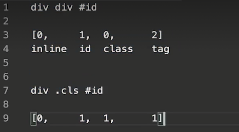

学习笔记(未完成)

# 浏览器工作原理

### 1.HTML解析 | HTML parse模块的文件拆分

- URL -> HTML -> DOM -> DOM with CSS -> DOM with position -> Bitmap
- 第一步：拆分文件
  - ~

### 2.HTML解析 | 用FSM实现HTML的分析

- HTML standard - Tokenization

### 3.HTML解析｜解析标签

- parser.js

### 4.HTML解析｜创建元素

~

### 5.HTML解析｜处理属性

~

### 14.CSS计算｜specificity的计算逻辑

- 

